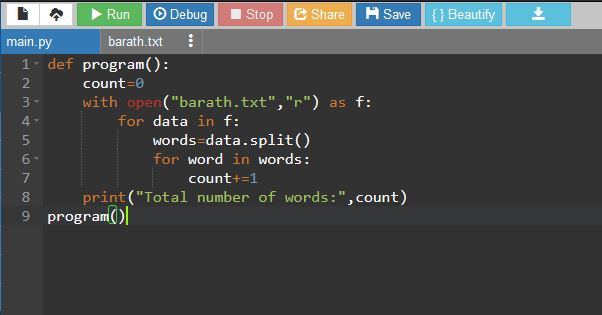

# Word-count
## AIM:
To write a python program for getting the word count from a text.
## EQUIPEMENT'S REQUIRED: 
PC
Anaconda - Python 3.7
## ALGORITHM: 
### Step 1:
Start
### Step 2: 
 Declare a variable count equal to 0.
### Step 3: 
Open the required text file in read mode as text.(any name can be used).
### Step 4:  
Loop until variable i in file text.
### Step 5: 
Declare variable word
### Step 6: 
Print the value of count, which has the number of words in the file
## PROGRAM:
```
def program():
    count=0
    with open("barath.txt","r") as f:
        for data in f:
            words=data.split()
            for word in words:
                count+=1
    print("Total number of words:",count)
program()
```

### OUTPUT:



## RESULT:
Thus the program is written to find the word count from a text.
